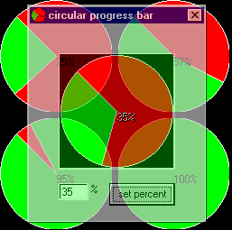



## progress CIRCLE \- not bar

### Description

this is a circular progress bar.. even though it is not a bar. you can input a percent, and it will make the "progress" accordingly. it is heavily annotated. it uses the api calls textout, extfloodfill, ellipse, and pie. perhaps the next update will include the ability to have max and min values.
 
### More Info
 
requires no extra custom controls

             |
---                |---
**Submitted On**   |2002-06-23 22:24:42
**By**             |[Rodent from the Pointe](https://github.com/Planet-Source-Code/PSCIndex/blob/master/ByAuthor/rodent-from-the-pointe.md)
**Level**          |Intermediate
**User Rating**    |5.0 (25 globes from 5 users)
**Compatibility**  |VB 6\.0
**Category**       |[Miscellaneous](https://github.com/Planet-Source-Code/PSCIndex/blob/master/ByCategory/miscellaneous__1-1.md)
**World**          |[Visual Basic](https://github.com/Planet-Source-Code/PSCIndex/blob/master/ByWorld/visual-basic.md)
**Archive File**   |[progress\_C979506232002\.zip](https://github.com/Planet-Source-Code/rodent-from-the-pointe-progress-circle-not-bar__1-36190/archive/master.zip)

